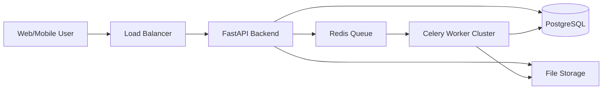

# Architecture & Scaling Strategy

## Current State: Streamlit Monolith
Currently, **FraudGuard AI** runs as a single-instance Streamlit application.
- **Frontend**: Streamlit (Python-generated HTML/JS).
- **Backend**: Python (pandas/scikit-learn) running in the same process.
- **State**: In-memory (`st.session_state`).

### Limitations
- **Concurrency**: Streamlit is synchronous by default. Heavy forensic analysis blocks other users.
- **Memory**: Large datasets load into RAM. 100 users uploading 100MB CSVs = 10GB RAM.
- **Scalability**: Vertical scaling only (bigger server).

---

## Proposed Production Architecture (Scaling Up)

To scale to thousands of users, we must decouple the components.

### 1. Frontend: Modern Web Framework
Move away from Streamlit for the user-facing app.
- **Tech**: React.js, Vue.js, or Next.js.
- **Benefit**: Highly responsive, mobile-first, static asset caching (CDN), separation of display logic from compute.

### 2. Backend: API Layer
- **Tech**: FastAPI or Django (Python).
- **Role**: REST API to handle authentication, file uploads, and serving results.
- **Security**: JWT Authentication (proper separate auth service).

### 3. Asynchronous Task Queue (The Fraud Engine)
Heavy lifting (Isolation Forest, Benford's Law) should not happen in the API request-response cycle.
- **Tech**: Celery + Redis (Broker).
- **Flow**:
    1. User uploads file -> API saves to S3/GCS -> API pushes job ID to Redis.
    2. Worker (Celery) picks up job -> Downloads file -> Runs `fraud_forensics.py` -> Saves JSON results to DB.
    3. Frontend polls API for status -> Displays dashboard when ready.

### 4. Database
- **Tech**: PostgreSQL.
- **Data**: User profiles, subscription status, transaction metadata, audit logs.
- **NoSQL (Optional)**: MongoDB or Elasticsearch for storing raw transaction logs if schema varies wildly.

### 5. Deployment & Infrastructure
- **Containerization**: Docker for all services (Frontend, Backend, Workers).
- **Orchestration**: Kubernetes (K8s) or AWS ECS for auto-scaling.
    - *Auto-scale workers based on Queue depth.*
- **Load Balancer**: Nginx or AWS ALB to distribute traffic.

## Mobile Strategy
- **Responsive Web App (PWA)**: The React/Next.js frontend should be fully responsive.
- **Native**: If deep native integration is needed (e.g., receipt scanning via camera), wrap the React app in **Capacitor** or build native iOS/Android apps hitting the same FastAPI backend.

## Summary Diagram

